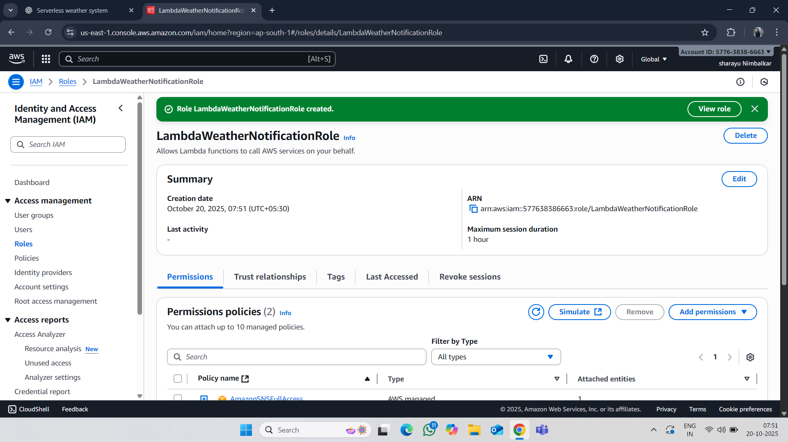
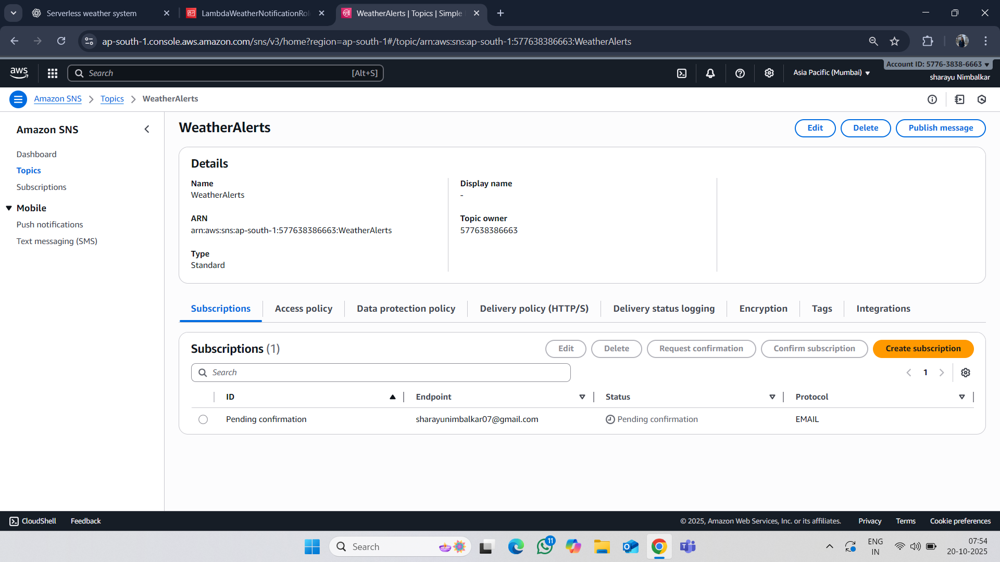
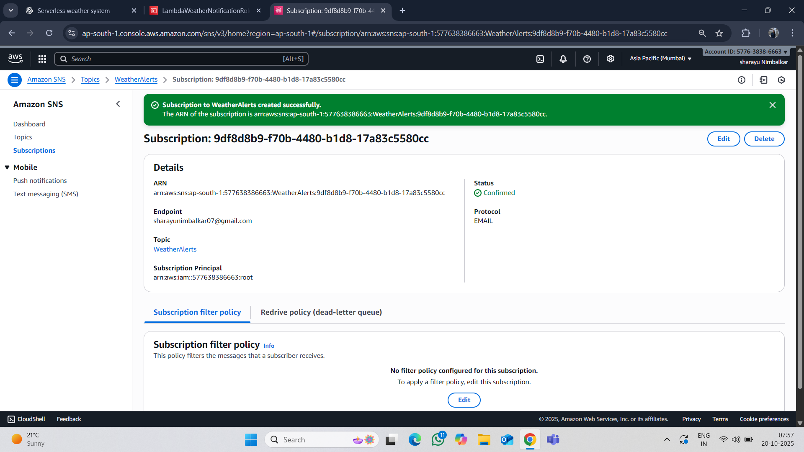
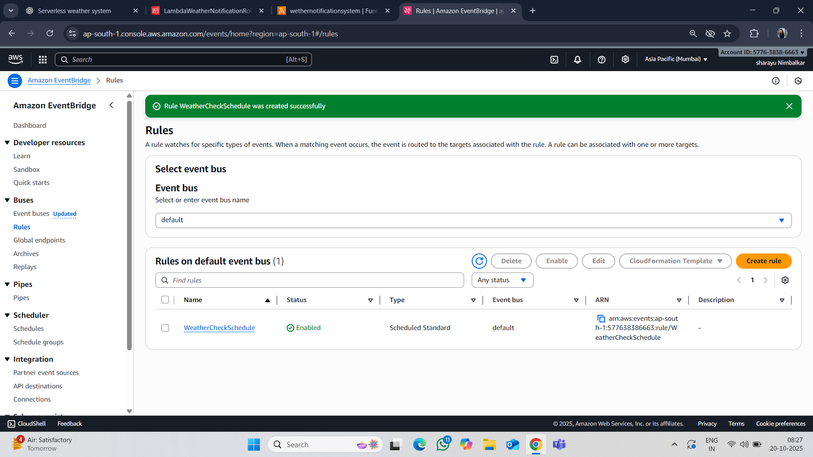

# Serverless_Weather_Notification_System

🔹 Overview

The Serverless Weather Notification System is an AWS-based application that fetches weather data from an external API and sends notifications (via email or SMS) using AWS services.

It is fully serverless, leveraging AWS Lambda, SNS, and EventBridge to automate notifications without managing servers.

🏗️ Architecture

Components:

 AWS Lambda: Executes code to fetch weather data.
 Amazon SNS: Sends notifications to subscribers via email or SMS.
 Amazon EventBridge: Schedules Lambda executions periodically.
 Weather API: Provides weather data (like OpenWeatherMap API).

✅ Prerequisites

AWS account with proper permissions

Python installed (depending on Lambda code)

Weather API key (e.g., OpenWeatherMap)

🛠️ Step-by-Step Setup

1️⃣ Create IAM Role

Purpose: To give permission for Lambda to publish messages to SNS and write logs.

Go to IAM → Roles → Create Role

Select Trusted Entity: AWS Service

Use Case: Lambda

Attach Policies:

AWSLambdaBasicExecutionRole → allows Lambda to write logs to CloudWatch

AmazonSNSFullAccess → allows Lambda to send messages via SNS

Name Role: LambdaWeatherNotificationRole

Click Create Role

2️⃣ Create an SNS Topic

Go to AWS SNS Console.

Click Create Topic → Choose Standard → Enter WeatherAlerts as the topic name.

Note the ARN (e.g., arn:aws:sns:ap-south-1:123456789012:WeatherAlerts).

2️3️⃣ Subscribe to the Topic

In the SNS Topic, click Create Subscription.

Choose protocol:

✉️ Email → Enter your email address.

📱 SMS → Enter your phone number.

Confirm the subscription via the link sent to your email or SMS.

4️⃣ Create a Lambda Function

Go to AWS Lambda Console → Click Create Function.

Choose Author from scratch → Name: WeatherNotifier.

Runtime: Python 3.11 or Node.js 18.x.

Permissions:

Attach policy: AWSLambdaBasicExecutionRole

Attach policy: AmazonSNSFullAccess (or least privilege to publish to SNS)

5️⃣ Add Lambda Code

⚠️ Update SNS_ARN, API_KEY, and CITY with your values.

6️⃣ Configure EventBridge Rule

Go to Amazon EventBridge → Rules → Create Rule.

Select Schedule → Set a cron expression or rate (e.g., cron(0 8 * * ? *) for every day at 8 AM).

Choose target: Lambda function (WeatherNotifier).

Save the rule.

⏰ EventBridge Role: Automatically triggers Lambda at the scheduled time, ensuring weather notifications are sent daily without manual intervention.

7️⃣ Test Lambda

Go to Lambda → Test → Configure test event.

Use default JSON ({}) → Click Test.

Check your email or SMS for the weather update.

🎯 Conclusion

This system provides automated, serverless weather notifications using AWS Lambda, SNS, and EventBridge. It is scalable, cost-effective, and requires no server management. ✅